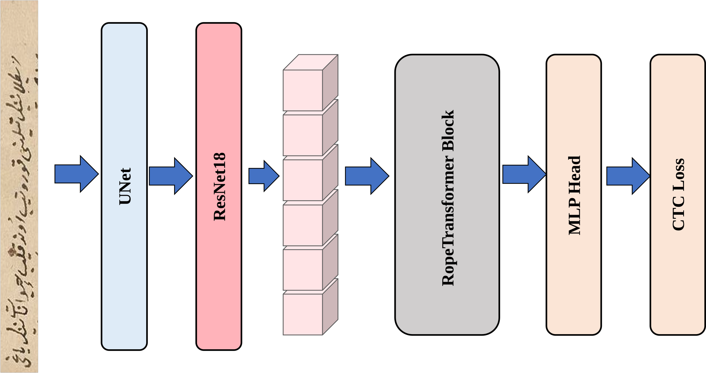
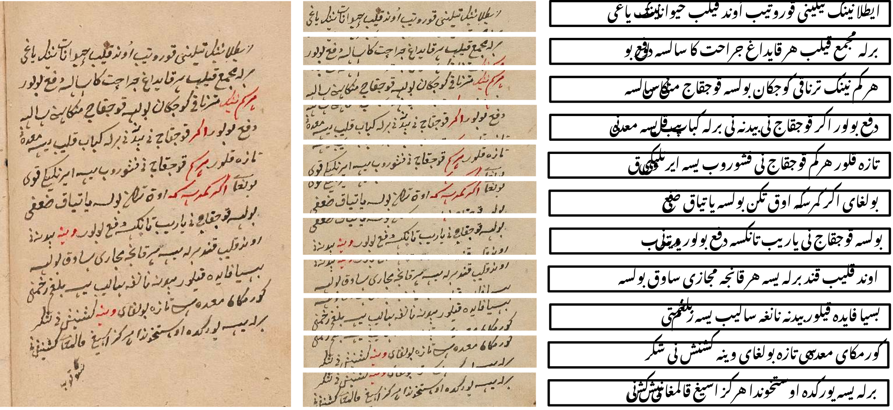
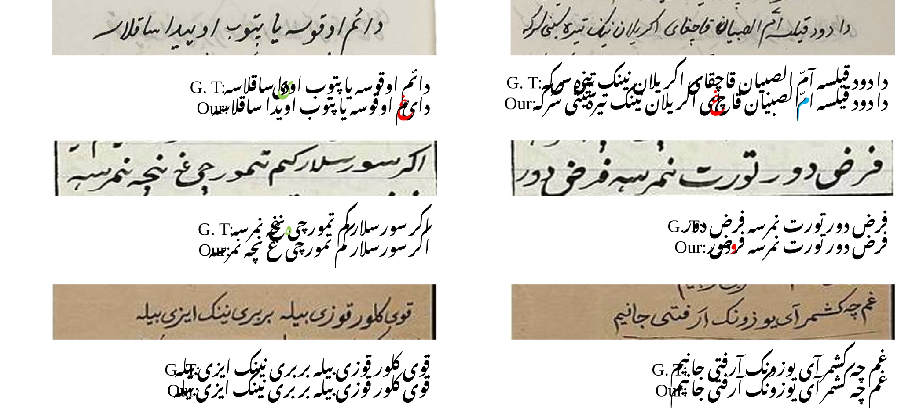

# 📘 CTR-Net

Official implementation of our Chagatai handwritten text recognition framework:

**CTR-Net and LSHC: End-to-End Handwritten Text Recognition for Chagatai Script**

> This repository contains the PyTorch implementation, training / evaluation scripts, and experimental configurations used in our Chagatai handwritten OCR experiments.

------

# Table of Contents

- 1. Introduction

- 2. LSHC Dataset

- 3. Repository Structure

- 4. Environment

- 5. Dataset Preparation

- 6. Quick Start

  - 6.1 Training
  - 6.2 Testing

- 7. Experimental Results

- 8. Reproducibility Notes

- 9. Acknowledgement

- 10. Citation

------

# 1. Introduction

Handwritten Chagatai text recognition is a challenging low-resource OCR task due to:

- substantial glyph positional variations,
- complex cursive ligatures,
- severe manuscript degradation,
- and the lack of large-scale annotated datasets.

To address these challenges, we propose:

- **LSHC**
   (Line Segmented Handwritten OCR Dataset for Chagatai)

and

- **CTR-Net**
   (Chagatai Text Recognition Network)

an end-to-end handwritten text recognition framework specifically designed for Chagatai manuscripts.

CTR-Net integrates:

- **U-Net** for multi-scale feature enhancement,
- **ResNet18** for deep visual feature extraction,
- and a **Transformer encoder with 2D Rotary Positional Encoding (2D RoPE)** for sequence modeling.

The overall goal is to improve robustness against:

- complex handwritten structures,
- document degradation,
- and low-resource training conditions.

------

# Overview

<p align="center">    </p>

------

## Main Characteristics

- End-to-end handwritten text recognition
- Specifically designed for **Chagatai manuscripts**
- Trained from scratch
- No external language model
- No beam search during inference
- Multi-stage data augmentation
- 2D Rotary Positional Encoding (RoPE)

------

# 2. LSHC Dataset

We construct:

## LSHC

(Line Segmented Handwritten OCR Dataset for Chagatai)

based on the ATMO project:

- Annotated Turki Manuscripts from the Jarring Collection Online

The dataset construction pipeline includes:

- automatic line segmentation,
- manual verification,
- text-image alignment,
- and multi-stage data augmentation.

------

## Dataset Statistics

| Split      | Page-level Images | Line-level Samples |
| ---------- | ----------------- | ------------------ |
| Train      | 463               | 4958               |
| Validation | 20                | 208                |
| Test       | 52                | 538                |

After augmentation, the training set expands to approximately:

```
45,000 samples
```

------

## A Dataset Example

<p align="center">    </p>

------

# 3. Repository Structure

```shell
CTR-Net/
│
│  train.py
│  test.py
│  README.md
│
├─data # Dataset and Dataset organization code.
│  ├─dataset.py
|  ├─format_datasets.py
│  └─transforms
│
├─model # Core model implementation:
│  ├─CTR_Net.py
│  ├─resnet18.py
│  └─unet.py
│
├─run # Convenient shell scripts for: training and testing,
│  └─LSHC.sh
│
├─utils
│  ├─option.py
│  ├─sam.py
│  └─utils.py
└─figs # Figures used in README and paper.
```

------

# 4. Environment

## Tested Environment

All experiments were conducted under:

- Ubuntu 20.04.6 LTS
- Python 3.10.18
- CUDA 12.1
- PyTorch 2.2.2
- NVIDIA RTX 3090 (24GB)

Training and inference were performed on a single GPU.

------

## Main Dependencies

```shell
torch==2.2.2
torchvision
numpy
opencv-python
Pillow
tqdm
matplotlib
einops
tensorboard
editdistance
```

------

## Installation

We recommend using Conda:

```shell
conda create -n ctr_net python=3.10 -y
conda activate ctr_net
```

Install PyTorch:

```shell
pip install torch torchvision torchaudio
```

Install remaining dependencies:

```shell
pip install numpy opencv-python Pillow tqdm matplotlib einops tensorboard editdistance
```

------

# 5. Dataset Preparation

Due to copyright and manuscript licensing considerations, the complete LSHC dataset is currently not directly redistributed in this repository.

Researchers interested in accessing the dataset may contact the corresponding authors Hankiz Yilahun(hansumuruh@xju.edu.cn ).

------

## Expected Folder Structure

```
./data/
└── LSHC/
    ├── train.ln
    ├── val.ln
    ├── test.ln
    └── lines/
        ├── xxx.jpg
        ├── xxx.txt
        └── ...
```

------

# 6. Quick Start

------

## 6.1 Training

```shell
bash run/train.sh
```

------

## 6.2 Testing

```shell
bash run/test.sh
```

------

# 7. Experimental Results

## Comparison with Representative HTR Methods

| Model              | CER (%)  | WER (%)   |
| ------------------ | -------- | --------- |
| GRCNN              | 57.38    | 105.71    |
| CNN-RNN Hybrid     | 69.43    | 106.96    |
| CRNN               | 33.12    | 85.16     |
| ViT                | 9.50     | 32.39     |
| Transformer        | 12.30    | 37.72     |
| HTR-VT             | 6.42     | 20.26     |
| **CTR-Net (Ours)** | **5.65** | **16.59** |

------

## Qualitative Results

<p align="center">    </p>

The model demonstrates strong robustness under:

- severe background noise,
- cursive ligatures,
- and degraded manuscript conditions.

------

# 8. Reproducibility Notes

## Training Configuration

- Optimizer: SAM
- Learning rate: 1e-3
- Batch size: 64
- Training iterations: 100,000
- Warmup iterations: 1,000
- Random seed: 123

------

## Inference Configuration

- No beam search
- No external language model

------

# 9. Acknowledgement

This work was supported by:

```shell
Tianshan Talents Cultivation Program - Leadings Talents for Scientific and Technological Innovation
(No. 2024TSYCLJ0002)
```

We sincerely thank the ATMO project for providing valuable Chagatai manuscript resources.

------

# 10. Citation

If you find this repository useful for your research, please consider citing:

```
@article{CTRNet2026,
  title={CTR-Net and LSHC: End-to-End Handwritten Text Recognition for Chagatai Script},
  author={Pan, Yuan and Jia, Mingshi and Hasan, Osmanjan and Hamdulla, Askar and Yilahun, Hankiz and Islam, Hoxur},
  year={2026},
  note={Manuscript in preparation}
}
```

------

# Contact

If you encounter issues related to:

- training,
- reproduction,
- or dataset,

please feel free to open an issue in this repository.